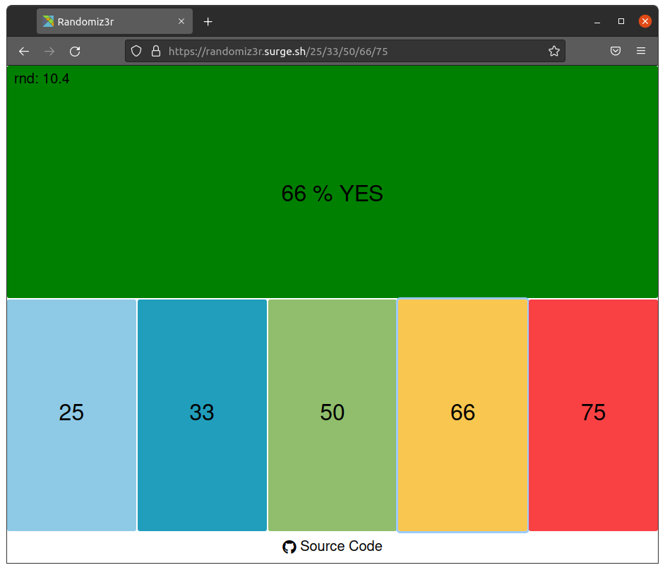
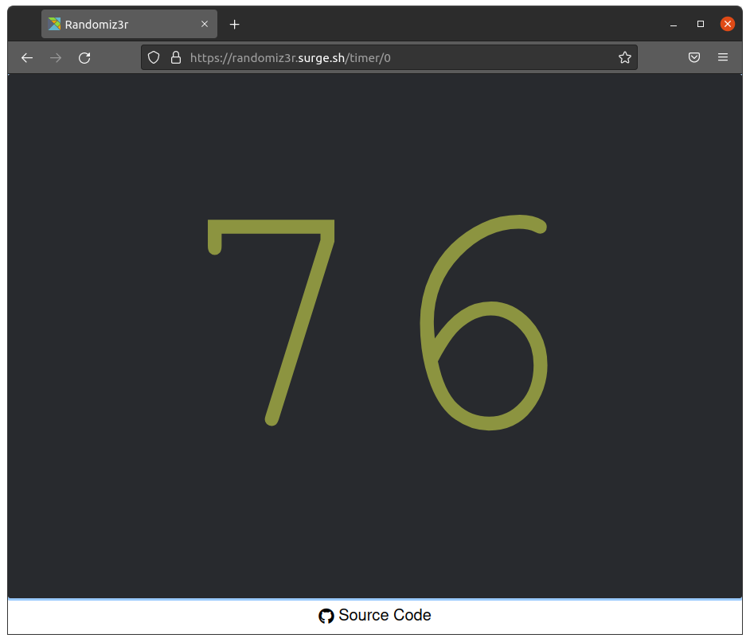

# Randomizer / RNG

## Frequency Randomizer



### Usage

- Just [open the app](https://randomiz3r.surge.sh/25/33/50/67/75) in your browser on your computer or mobile device.
- When you click on one of the given frequencies, the app will output 'Yes' or 'No' randomly exactly with the chosen frequence.
- You can resize the browser window and place it anywhere on your desktop or open the link on your mobile device.

### Configure Frequencies

You can configure the 5 frequencies by changing the URL parameters:

```txt
https://randomiz3r.surge.sh/<freq_1>/<freq_2>/<freq_3>/<freq_4>/<freq_5>
```

Where `freq_[1..5]` should be values between 1 and 99. E.g.:

<https://randomiz3r.surge.sh/25/33/50/67/75>

## Random Number Generator (RNG)

A random number generator that generates random numbers between 0 and 99 either on left-click or in regular intervals.



### Usage

- Open [the app](https://randomiz3r.surge.sh/timer/3) in your browser on your computer or mobile device.
- Resize the browser window and place it on your desktop or use a mobile device.
- Left-click generates a new random number.
- Specify a time interval in seconds to trigger the RNG with the last URL parameter:
  - E.g. `https://randomiz3r.surge.sh/timer/5` triggers every 5 seconds
  - Use `0` to trigger only on left-click (`https://randomiz3r.surge.sh/timer/0`)

## Other Poker Software

Run range vs range equity calculations in your browser with [Equiweb](https://github.com/battermann/poker-equity-calculator-ui).